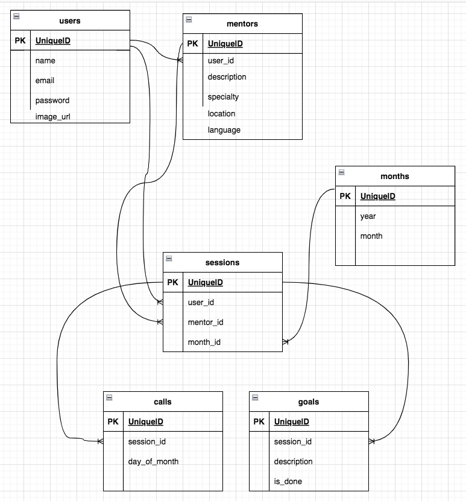

# mentorOn

A full stack web application built with React, Node.js, Express, and PostgreSQL that allows users to browse mentors, book mentorship sessions, view interactive dashboards, schedule calls, set goals, and track progress. STACK: React, JavaScript ES6, Node.js, Express, PostgreSQL

## Getting Started

1. Create the `.env` by using `.env.example` as a reference: `cp .env.example .env`
2. Update the .env file with your correct local information 
  - username: `labber` 
  - password: `labber` 
  - database: `finalproject`
3. Install dependencies: `npm i`
4. Fix to binaries for sass: `npm rebuild node-sass`
5. Reset database: `npm run db:reset`
  - Check the db folder to see what gets created and seeded in the SDB
7. Run the server: `npm run local`
  - Note: nodemon is used, so you should not have to restart your server
8. Visit `http://localhost:8080/`

## Warnings & Tips

- Do not edit the `layout.css` file directly, it is auto-generated by `layout.scss`
- Split routes into their own resource-based file names, as demonstrated with `users.js` and `widgets.js`
- Split database schema (table definitions) and seeds (inserts) into separate files, one per table. See `db` folder for pre-populated examples. 
- Use the `npm run db:reset` command each time there is a change to the database schema or seeds. 
  - It runs through each of the files, in order, and executes them against the database. 
  - Note: you will lose all newly created (test) data each time this is run, since the schema files will tend to `DROP` the tables and recreate them.

## Dependencies

- Node 10.x or above
- NPM 5.x or above
- PG 6.x

## ERD 

## MentorOn Landing Page

## MentorOn Services

## Login Page

## Footer Section

## Find Mentors Page

## Mentee Dashboard pt.1

## Mentee Dashboard pt.2

## Mentor Dashboard pt.1

## Mentor Dashboard pt.2

## Payment Page

## MentorOn Chatbot 
